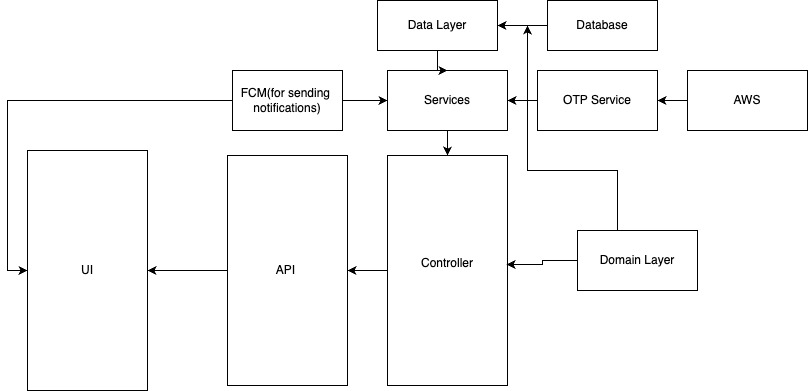

# NicaAgua Backend Setup

## Table of Contents
- [Introduction](#introduction)
- [Prerequisites](#prerequisites)
- [Installation](#installation)
- [Environment Setup](#environment-setup)
- [Running the Backend](#running-the-backend)
- [Admin Login](#admin-login)
- [Postman Setup](#postman-setup)
- [Backend Structure](#backend-structure)

## Introduction
This document provides instructions to set up and run the backend for the NicaAgua project. It covers the installation of dependencies, environment configuration, running the code locally, and using Postman for API testing.

## Prerequisites
Before you begin, ensure you have the following:
- Access to the Frugal Account on Firebase
- Node.js and npm installed
- Postman installed

## Installation
1. **Clone the repository:**
   ```sh
   git clone https://github.com/FrugalInnovationHub/NicaAgua-Backend.git
   cd nicaagua-backend
   ```

2. **Install all dependencies:**
   ```sh
   npm install
   ```

## Environment Setup
1. **Add the `.env` file:**
   - Create a `.env` file in the root directory of the project.
   - Add the necessary environment variables as specified by the project requirements.

2. **Firebase Console Access:**
   - Login to the Firebase console using the Frugal Account to get access to the database.

## Running the Backend
To run the backend, use the following command:
```sh
firebase emulators:start
```
This command starts the Firebase emulators to run the code locally.

## Admin Login
Use the following credentials to log in as an admin:
```json
{
    "phoneNumber": "7",
    "password": "123"
}
```

## Postman Setup
1. **Import the Postman collection:**
   - Import the provided Postman collection into your local Postman application.

2. **Using the Postman collection:**
   - The Postman collection includes scripts to automatically set the user token, so you don't need to manually set it.

## Backend Structure
Refer to the diagram below for the structure of the backend:



This diagram outlines the various components and their interactions within the backend system.

---

With this structured README, you should have a clear guide to setting up and running the NicaAgua Backend. If you encounter any issues, refer to the respective sections for troubleshooting.